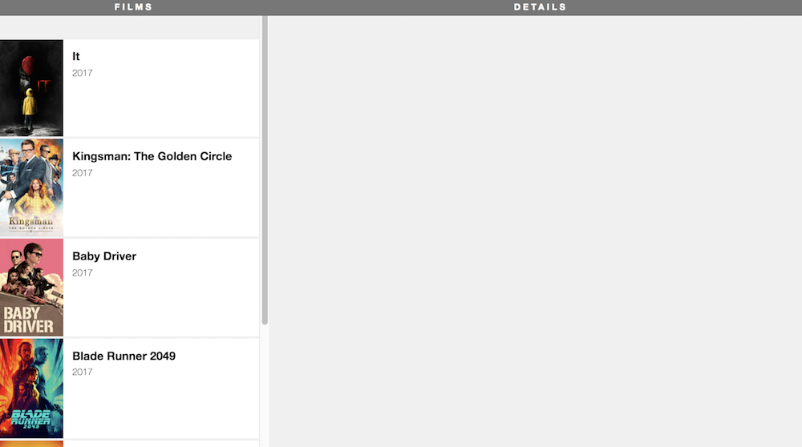

#  Starting a Film Project

Clone this [starter repo](https://github.com/WDI-SEA/react-film-starter-repo), `npm install`, and run with `npm start`.

## Your Mission

Today the plan is to identify the app components, create the overall structure, then split that structure into individual components. You'll pass films as props to each component and ultimately use iteration to render one component for each film. At the end of this exercise, you will have this app:



### Tasks

**Important**: After each step below, check your application to see how it looks before going to the next one. It's good practice to be sure your app is working correctly before adding new functionality.

<details>
  <summary>Hint</summary>
  Don't forget any <code>import</code> statements as you add more files.
</details>

#### Step 1: Create baseline layout

First, create the layout. You'll have a Films column and a Details column.

Make the provided `App` component render the following code:

```html
<div className="film-library">
  <div className="film-list">
    <h1 className="section-title">FILMS</h1>
  </div>

  <div className="film-details">
    <h1 className="section-title">DETAILS</h1>
  </div>
</div>
```

#### Step 2: Create new components

Move the `film-list` and `film-details` divs into their own separate components (in separate files), `FilmListing.js` and `FilmDetails.js`, respectively.

Make sure you now call these components in `App.js`. Check your app in the browser. If you've done it right, nothing will have changed, and the application will look the same.

#### Step 3: Pass props to the new components

Our films data is stored in the `TMDB.js` file in the `src` folder. Pass the `films` array to each of your new components as props.

If you check your file, it still shouldn't look differently. We're sending the props to the components, but we are not using the props yet.

<details>
  <summary>Hint</summary>
  For now, this step is just changing the <code>App.js</code> file to be sure it imports the film file and passes props.
  <code>
    
    import React, { Component } from 'react';
    import './App.css';
    import FilmListing from './FilmListing';
    import FilmDetails from './FilmDetails';
    import TMDB from './TMDB';
    
    class App extends Component {
      render() {
        return (
          <div className="App">
            <div className="film-library">
              <FilmListing films={TMDB.films} />
              <FilmDetails films={TMDB.films} />
            </div>
          </div>
        );
      }
    }

    export default App;
    
  </code>
</details>

#### Step 4: Render a film

In the `FilmListing` component, render the title of just 1 film as an `<h1>`, below the `section-title`.

Does "It" appear on the left side of your browser?

<details>
  <summary>Hint</summary>
  The films prop is an array, and you just want the title from the first one.
</details>


#### Step 5: Create and render an array of film title elements

In the `render()` of `FilmListing` (above the return), create an `allFilms` variable that uses [`.map()`](https://developer.mozilla.org/en-US/docs/Web/JavaScript/Reference/Global_Objects/Array/map) to iterate over the array of films and return an element to display the title for each one:

```js
  <div className="film-row">
    <h1>{film.title}</h1>
  </div>
```

Using JSX, display `allFilms` underneath the `<h1 className="section-title">FILMS</h1>` heading.

You should have a list of all the films appear in the left column.

<details>
  <summary>Step 5 solution:</summary>
  <code>
    
    render() {
      const allFilms = this.props.films.map((film) =>{
        return (
          <div className="film-row">
            <h1>{film.title}</h1>
          </div>
        )
      })
      return (
          <div className="film-list">
            <h1 className="section-title">FILMS</h1>
            {allFilms}
          </div>
      );
    }
  
  </code>
</details>

#### Step 6: Move the film rows to their own component

Now we're going to move each of these `film-row` divs into a `FilmRow` component.

* Create a `FilmRow.js` component. 
* Modify your `allFilms` array so that your `map` function returns a `FilmRow` component.
* Pass the entire film to each `FilmRow` component as a `film` prop.

<details>
  <summary>Hint 1: </summary>
  Don't forget to import <code>FilmRow</code> so you can use it in your <code>map</code> iterator.
</details>

<details>
  <summary>Hint 2: </summary>
  Inside your <code>FilmRow</code> component, <code>film</code> is now, a prop, so you'll need to access it with <code>this.props.film</code>.
  </details>

#### Step 7: Flesh out each film row

Make each film row in the film list look like the main finished image, using the following markup (replace "TITLE" and "YEAR" with the actual title and year of the film).

```
<div className="film-row">
  

  <div className="film-summary">
    <h1>TITLE</h1>
    <p>YEAR</p>
  </div>
</div>
```

- You'll have to create the `posterUrl` for each film by combining the prefix `https://image.tmdb.org/t/p/w780/` with each film's `poster_path` property.

<details>
  <summary>Hint: getting the year</summary>
  You'll also have to extract the year from the <code>release_date</code> property. To do this, you could use the <code>split()</code>, <code>substring()</code> or <code>getFullYear()</code> JS method.
</details>


#### Step 8: Move film posters to their own component

* Create a `FilmPoster` component that resceives a `poster_path` prop.
* Replace the `img` tag in your `FilmRow` component with a `FilmPoster` component that receives a `poster_path`