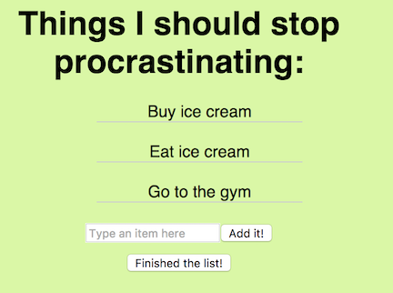
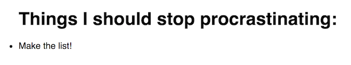
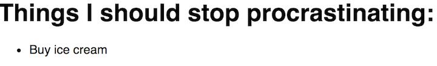
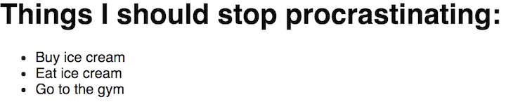

#  ToDo List Exercise

## Review


So, we've gone through all of the basics of React. To really hammer it home with practice, let's walk through complete creation of an app. This will be a to-do list, keeping track of everything we need to do for the day (after we finish this!). It's a lot, so we're going to want it to be editable.

This is what our list will look like when we're finished:



Let's get started!


* Because this is a new exercise, be sure to close the running application in Terminal first.

Change directories to the main directory you're storing your projects in. Inside it, run your command:

```sh
$ create-react-app todo-list
```

The tool created a new directory for our app, so let's move into it...

```sh
$ cd todo-list
```

Use `npm start` to start a server that will serve your new React application!


```sh
$ npm start
```

* Check it out! If you browse to http://localhost:3000, you should have a fresh react app.

* Make sure that as you go, you frequently check the site to ensure your changes are all reflecting accurately!

## First, the basic list.

Let's change the name of the component in `App.js` to something more meaningful, like `MyList`. Also change the name of the file from `App.js` to `MyList.js`, since best practices include keeping the file name the same as the component it contains as often as possible.

Then, we'll change the contents of the HTML to have a header and the start of a list.

This looks like:

```js
import React, { Component } from 'react';
import './App.css';

class MyList extends Component {
  render() {
    return (
      <div>
        <h1> Things I should stop procrastinating:</h1>
        <ul>
          <li></li>
        </ul>
      </div>
    )
  }
}

export default MyList
```

> Remember to change the name of the component where it's rendered in index.js! You'll also have to change the `import` statement in `index.js`, since you changed the name of the file containing the component that `index.js` is importing from!

`index.js` now looks like this:


```js
import React from 'react';
import ReactDOM from 'react-dom';
import MyList from './MyList';
import './index.css';

var toDos = ["Buy ice cream", "Eat ice cream", "Go to the gym"]

ReactDOM.render(
  <MyList theList={toDos} />,
  document.getElementById('root')
)

```

Now, our webpage displays an empty list.

We've learned that we should make new files for each component and that different functionalities should be split into different components.

Let's make a component for `ListItem`s. This component can simply render  `<li>Make the list!</li>` so that we are starting with something in this list.

* Remember to use an `export` statement at the end of the new file to make the code in this file available elsewhere in our application.

* Don't forget to import your `ListItem` component into `MyList.js`.  Then, include the component in what `MyList` renders with `<ListItem />` under the existing header (in place of the existing list item)!


At this point, our app looks like this:



## Side note - let's quickly format it a little more nicely!

Since we'll be looking at this for a while, let's make it less of an eyesore. Feel free to change the `index.css` file to include anything you'd like; on mine, I've centered the text and given it a light green background. You can grab mine [here](images/index.css).

## Second, props.

This is a great start - we've already nested components (`ListItem` inside of `MyList`). Now, let's add some props to make this useful and check that current list item off!

Let's first just pass a prop into `ListItem` from `MyList`. We'll call the prop something simple, like `doThis`. I'm pretty hungry; I'll pass in a value of "buy ice cream."

Then, in `ListItem`, we'll add a list item that uses the `doThis` prop instead of the existing hard-coded text.

Now, we have in `MyList.js`:
```js
import React, { Component } from 'react';
import './App.css';
import ListItem from './ListItem';

class MyList extends Component {
  render() {
    return (
      <div>
        <h1>Things I should stop procrastinating:</h1>
        <ul>
          <ListItem doThis="Buy ice cream" />
        </ul>
      </div>
    )
  }
}

export default MyList
```


... and in `ListItem.js`:

```js
import React, { Component } from 'react';
import './App.css';

class ListItem extends Component {
  render() {
    return (
      <div>
        <li>{this.props.doThis}</li>
      </div>
    )
  }
}

export default ListItem
```

Our app now looks like this:



## Third, render different items in an array.

If we want to make this a truly extensible list, we could create an array of items, pass them into props through the `ListItem` component, and then render each item. Let's do that now.

Borrowing from a bonus exercise earlier, the easiest way to do this is by using the `map` function. A map is like a `for` loop. With `map`, you make a new variable and iterate through each item in an array with it. It looks like this:


```js
let <new_Variable_Name> = <the_Array_We_Are_Mapping>.map( (local_Variable_Name_to_Loop, index) => (
  <what_To_Do_With_Each_Item_in_Loop>
))
```

Here's a simple example that makes a new array by adding an `!` to each element of an array.
```js
const phrases = ['ice cream', 'dinosaurs', 'hobbits']
let excitedPhrases = phrases.map( (phrase, index) => {
  return newPhrase = phrase + '!'
})
// excitedPhrases is ["ice cream!", "dinosaurs!", "hobbits!"]
```


##### Plan

* In the `MyList` component, have an array of items for the list, uncreatively called `theList`.
* Create a variable to refer to the new array output by the `map` method, uncreatively but helpfully called `todoItems`.
* Use `map` to iterate through the `todoItems` array, one `item` (this could be any name you'd like) at a time, and use each one to create a `ListItem` component in the `todoItems` list.
* We can later refer to this list by just calling the variable in JSX (like any other variable).  For example, we could say  `{todoItems}`.

##### Implementing the Plan

Here is the `map` function call that will do this for us, which we'll put in the `MyList` component.:

```js
let todoItems = this.props.theList.map( (item, index) => (
  <ListItem doThis={item} key={index} />
))
```

Let's also actually create that array! In `index.js`, create an array variable called `toDos`. Fill it with what you need to do for the day.

My final `MyList` component class looks like this:

```jsx
class MyList extends Component {

  render() {

    let todoItems = this.props.theList.map( (item, index) => (
      <ListItem doThis={item} key={index} />
    ))

    return (
      <div>
        <h1>Things I should stop procrastinating:</h1>
        <ul>
          {todoItems}
        </ul>
      </div>
    )
  }
}
```

And the `index.js` file:

```js
import React from 'react';
import ReactDOM from 'react-dom';
import MyList from './MyList';
import './index.css';

var toDos = ["Buy ice cream", "Eat ice cream", "Go to the gym"]

ReactDOM.render(
  <MyList theList={toDos} />,
  document.getElementById('root')
)

```

And the `ListItem.js`, which hasn't changed:
```js
import React, { Component } from 'react';
import './App.css';

class ListItem extends Component {
  render() {
    return (
      <div>
        <li>{this.props.doThis}</li>
      </div>
    )
  }
}

export default ListItem

```

Now what we have is:


#  ToDo List Exercise: State

Now we have a todo list! But.. it isn't changeable, and we can't just _think about_ eating ice cream and going to the gym forever. At some point, we have to actually eat the ice cream (deleting it from the list) and find a gym buddy (adding that to the list). In other words, we need to be able to change the list!

Remember, in a React component, `state` is just another object, like `props`. The only difference is that `state` can be changed (remember, though, to always change it through the method `setState`). The exception is setting the initial state, which is only done once: when initializing a React component with its constructor. In order to pass items to the `ToDoList` component and make them mutable, we'll need to set the state of our `MyList`. Let's continue refactoring our `MyList` component to change the `todoItems` array through state.

## Clearing the items
We're going to add a button to the list that allows users to clear away
everything in it. First, let's make sure the list is all set up to display
items properly already:

* At the top of the `MyList` component, create a constructor that sets an initial state for an attribute called `toDoItemArray`. It should be equal to the initial list that's passed in.
* Don't forget to change the `map` call!
* Always check to be sure your website is accurate (it should still look the same).

Now, we'll look into making this list changeable. Remember, updating state will involve calling `setState`. Let's use a simple example with a "clear" button in `MyList`.


First, in `MyList`, we define the function that will be called by the button:

```js
clearList (e) {
  this.setState({
    toDoItemArray: []
  })
}
```

Then, add a button after the whole `<ul>` list.

**MyList.js**
```html
<ul>
  ...
</ul>
<button onClick={(e) => this.clearList(e)}>Finished the list!</button>
```

This makes our `MyList` component look like this:

**MyList.js**
```js
class MyList extends Component {

  constructor (props) {
    super()
    this.state = {
      toDoItemArray: props.theList
    }
  }

  clearList (e) {
    this.setState({
      toDoItemArray: []
    })
  }

  render() {

    let todoItems = this.state.toDoItemArray.map( (item, index) => (
      <ListItem doThis={item} key={index} />
    ))

    return (
      <div>
        <h1>Things I should stop procrastinating:</h1>
        <ul>
          {todoItems}
        </ul>
        <button onClick={(e) => this.clearList(e)}>Finished the list!</button>
      </div>
    )
  }
}

export default MyList
```

> Don't forget to try it out!

Now when we click on the button, the following will occur:
* `this.setState` will set the state, `toDoItemArray`, to be empty: `{toDoItemArray: []}`
* The render function for `MyList` will be called and re-render the component.
* We'll feel good about ourselves for going to the gym, even if we ate ice cream first.


 ### Sure-fire Coding
 There's lots of things that can go wrong when we try to hook up
 new functionality to our app. Our button might be set up wrong, it might not
 call the correct function, the function may have an error in it.

 Let's add a `console.log()` statement on the first line in our `clearList`
 function. This is an excellent debugging practice. Adding `console.log()` proves
 to us that the function is actually executing. This proves to us that there's
 nothing wrong with how we hooked up the button and helps narrow our focus in
 case something else went wrong.

 Let's say you click the button and the list isn't cleared.
 * If you didn't see `"Clearing list!"` in the console then you know something is
   wrong with the way you hooked up the button. Investigate that.
 * If you did see `"Clearing List!"` in the console and the list still didn't
   clear then you know you need to investigate your code inside the function
   after the click.

 Adding simple sanity checks like this to your code will make you a productive
 programmer.

 ```js
 clearList (e) {
   console.log("Clearing list!")
   this.setState({
     toDoItemArray: []
   })
 }
 ```

## Adding items

Let's add one more thing to our app: an input field for more items. In order to do so, we'll need a variable to represent the new item we'll be entering.

* Create a variable `newItem` in the state to hold the new item that the user inputs.

> Make a new state attribute, initializing `newItem` to a blank string. (Hint: remember, `state` is just a JavaScript object, so you you need a comma between key-value pairs.)

We'll also need two additional functions to represent the following changes in state:

* `newItemChange`, for when we type characters into an input field and change the value of `newItem`  
 * We'll need to get the current value of the input field and set state accordingly.
 > Create this function with an event parameter of 'e' like in `clearList`. Inside the function, change the state of `newItem` to `e.target.value` - this will be the value the user entered into the form.

* `addItem`, for when we submit the form
 * We'll need to make a copy of `toDoItemArray`, push the `newItem`, set `state` and finally clear `newItem`.
 > Create this function with an event parameter of 'e'. Inside the function, create a new variable initialized to the value of the array that is saved in state. Then, use `yourArray.push(<value>)` to push the new item from the state into the array. Set the `newItem` state back to an empty string, and set the `toDoItemArray` state to your new array.


Lastly, we'll need to add a form to our `render` method.

```js
<form>
  <input type="text"
   placeholder="Type an item here"
   onChange={(e) => this.newItemChange(e)}
   value={this.state.newItem}
  />
  <button onClick={(e) => this.addItem(e)}>Add it!</button>
</form>
```

Notes:
 * We can use `onChange` on the `input` field to trigger an event when the text in the box is changed.  
 * Any function called when an event occurs (like functions that happen `onClick`, `onSubmit`, or `onChange`) can accept an argument that is the event. We pass this in as `e` to `newItemChange` and `addItem`.

## Debugging Adding Items
If you click "Add it!" and the page doesn't change, and you think you've done
everything right there's one thing you're probably missing. Here's a good
debugging strategy to figure out what's wrong.

Add a `console.log` statement inside your `addItem` function to make sure the
function is actually being executed. If you don't see simple output in your
console then there's something wrong with how you hooked up the button to the
`addItem` function. You need to investigate how the button is attached to the
function.

If you click the button and an empty item appears in your list then you need
to investigate how you're retrieving the text value out of the form input.
Use a console statement to print the value of the text to make sure you're
accessing it correctly.

If you see a simple console statement working, and you see the correct text
being printed and you still don't see items added to the list correctly then
there's one last hiccup that causes lots of problems: the button is inside a
form and it triggers a `submit` event. Submit events make the page reload, or
(more accurately) navigate to the url `action` attribute of the form. If there's
no `action` attribute defined the page just navigates to itself, and reloads.

Make sure your `addItem` function accepts an `e` event parameter and calls
.preventDefault to stop the submit event from firing.

```js
addItem(e) {
  // prevent the event from running the default "submit" event.
  e.preventDefault()

  // then the rest of your code.
  // ...
}
```
