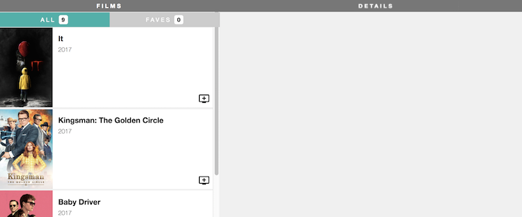

#  You Do: Film Exercise - State

## Your Mission

Stop any project you currently have running; let's go back to the film application that you've started. You can run the app with `npm start`.

Your goal today is to add some events to your app. You'll keep the events simple for now - each event will simply print a message to the console.
- In the future, however, you're going to be able to add films to your list of favorites, filter the films to see only your favorites, and see the details for a specific film. Your work today will make that possible.



### Tasks - Part 1: Adding Favorites

#### Step 1: Add a new `Fave` component

Create a new component called `Fave` that will eventually handle whether a movie is a user's favorite. The `Fave` component's `render` method should return the following:

```html
<div className="film-row-fave add_to_queue">
  <p className="material-icons">add_to_queue</p>
</div>
```

In the `FilmRow` component, underneath the `film-summary` `div`, render the `Fave` component.

In your browser, the icon should appear at the bottom right corner of each film row.

#### Step 2: Define a `handleClick` function in `Fave`

Inside the `Fave` component, define a function called `handleClick`. The function should accept an event (`e`) as an argument. Simply log out a message like `"handling Fave click!"` for now.

Since you aren't using this anywhere yet, nothing should change.

#### Step 3: Add an `onClick` in `Fave`

Now that you have a function that handles the user clicking a movie, connect it to the UI. In the `div` of `Fave`'s `render` function, add a parameter of `onClick={this.handleClick}`.

In your browser's JavaScript console, you should see the message `handleClick` prints out when the `div` is clicked.

That's all! Your click is not yet adding favorites, but it is working. Later, you will modify your app so that when the Fave icon is clicked, your app adds or removes the selected movie from the user's favorites array.

### Tasks - Part 2: Handling Filter Toggling

Eventually, you'll want an "ALL" heading and a "FAVES" heading that are clickable links - when the user clicks "ALL", the left sidebar will show all movies; when the user clicks "FAVES", the left sidebar will show only their favorite movies. Now, you'll make the basis of that.

#### Step 1: Define a `handleFilterClick` function in `FilmListing`

First set up the function that will determine what movies are shown in the list. You'll need to be able to tell if you are showing the user all of the movies or if you are filtering down to show the user just some of the movies.

In `FilmListing`, create a `handleFilterClick` function that takes a string `filter` as an argument. For now, just print a message that says `Setting filter to ` and the `filter` argument.

This new function isn't connected to a button in the UI yet, so nothing should change.

#### Step 2: Add provided markup to display the ALL/FAVES menu

Add some markup to the `FilmListing` component so that you can have something worth clicking. You'll keep the Films heading; underneath it, you'll add two categories of "ALL" and "FAVES". You're also setting up displaying the film's length, which you aren't using yet.

Change the `FilmListing` component to render this:

```html
<div className="film-list">
    <h1 className="section-title">FILMS</h1>
    <div className="film-list-filters">
        <div className="film-list-filter">
            ALL
            <span className="section-count">{this.props.films.length}</span>
        </div>
        <div className="film-list-filter">
            FAVES
            <span className="section-count">0</span>
        </div>
    </div>

    {allFilms}
</div>
```

If you check your browser, these subheadings should appear in the left column.

#### Step 3: Add `onClick` inside `FilmListing` to trigger filtering to `'faves'`

Now you have an ALL section and a FAVES section - you can hook that filtering function you just created up to it.

Add an `onClick` inside `FilmListing` so that when "FAVES" is clicked, it calls the `handleFilterClick` method you created with the parameter `'faves'`.

<details>
  <summary>Hint</summary>
  In order to pass in a parameter to a function, we have to open up parantheses, but doing so calls the function immediately. This is why <code>onClick={this.handleFilterClick('faves')}</code> makes handleFilterClick run immediately upon rendering of the component instead of when you click it. You'll need to stick with passing a function *definition* into onClick, so try wrapping this.handleFilterClick in an anonymous function like so:
  <code>onClick={() => this.handleFilterClick('faves')}</code>
</details>


Try clicking FAVES - does it print to the console?

#### Step 4: Add `onClick` inside `FilmListing` to trigger filtering to `'all'`

Now FAVES is clickable, so the next step is to make ALL clickable as well.

Add an `onClick` inside `FilmListing` so that when "ALL" is clicked, it calls the `handleFilterClick` method with argument `'all'`.

Now, you should see a message in the console when you click either option. Later, instead of viewing a message, clicking either option will display the correct list of movies to the user - but now you've assured the options are clickable, which is an important first step.

### Tasks - Part 3: Handling Film Details

You aren't yet going to be creating the large detailed view of the film that will be displayed on the right column, but you're going to start setting up for it.

#### Step 1: Define a function `handleDetailsClick` inside `FilmRow`

Inside `FilmRow`, define a function called `handleDetailsClick`. The function should accept a `film` as an argument. Print out `Fetching details for ` and the film title to the console.

Since this function isn't connected to the UI yet, nothing will change.

#### Step 2: Add a click handler to call the new function with film object

Now, connect `handleDetailsClick`. Add an `onClick` to `FilmRow` so that your message gets printed whenever you click on a film row - don't forget to pass the argument.

You should be able to check this in your console by clicking any film row.

#### Step 3: Add `stopPropagation` to `handleFave` event handler

Hold up! Notice that you are now seeing two messages every time you click on the Fave icon/button. This is tricky, but the reason is because the event is propagating upward to the `FilmRow`. To make it so only one message appears, you'll need to stop the event propagation.

To do this, inside the `Fave` component's `handleClick` function, add the line `e.stopPropagation()`.

Try clicking the Fave icon/button - there's only one message now.

### Tasks - Part 4: Add State to the `Fave` Component

You have now triggered the events you'll need to update your app. Next, you'll add states to your app - data in your React app that will change (like if the user adds a film to the Faves list)

#### Step 1: Create a constructor for the `Fave` component

The first state you'll add will be whether a currently selected film is a user's favorite.

Add a constructor method to the `Fave` component. Remember that any time you add a constructor to a class-based component, you have to call the `super` method (and pass it `props` if you need acces to `this.props` in the constructor).

#### Step 2 (NOT APPLICABLE IF USING ARROW FUNCTIONS): Bind your event handler to this component

`this` binding can be a very finicky topic in JavaScript, but there are tricks to using it. To make your event handler work properly, you'll need to bind `this` to it. (Arrow functions take care of this for you, so you can skip this part if you're using ES6!) 

Add this line to your `Fave` component's constructor:

```js
// This binding is necessary to make `this` work in the callback
this.handleClick = this.handleClick.bind(this)
```

This will be required for each event handler defined on any of your class-based components - so add it for all the `onClick` methods in your classes, in that class' constructor (make sure to change `handleClick` to the name of the function in that class).

#### Step 3: Set the initial state

By default, a film is not a user's favorite.

Back to the `Fave` component, set `this.state` to an object with the key `isFave` and the value `false`. This will set up the initial state of the component.

#### Step 4: Set the state in your event handler

When the user clicks the Fave icon/button to add or remove a film from their favorites list, the app should change the film's `isFave` state to reflect that.

Inside of the `handleClick` method on the `Fave` component, use `this.setState` to toggle the value of `isFave`. "Toggle" means you always want to set the new value to the opposite of the current value.

<details>
  <summary>Hint</summary>
  <code>isFave: !this.state.isFave</code> or use a ternery statement
</details>

#### Step 5: Set the `className` on `div` based on the `IsFave` state

You now want the `className` attribute on the `div` to dynamically update when the state is changed. Currently, the `className` on the `div` is `add_to_queue`. However, if the film is already favorited, then the film is already in the queue. Therefore, when `isFave: true`, the `className` should instead be `remove_from_queue`.

What you need to make this happen:
- When `isFave: true`, you want the `div` to have the class`remove_from_queue`. When `isFave: false` you want to the `div` to have the class `add_to_queue`.
- You also want to change the text that's rendered in the `p` to be the same text as the class - `remove_from_queue` or `add_to_queue`.

Note: It will be easier to read if you determine which class to set first, store that value in a variable, then insert that variable into the `className` attribute.

<details>
  <summary>Hint</summary>
  You can set <code>isFave</code> in the <code>render</code> method, but make sure it's above the <code>return</code> statement. Try using string interpolation to insert the variable in to className without having to replace the <code>film-row-fave</code> classname every time. (Remember you're in JSX, so you'll need to wrap the back-ticks in curly brackets!)
</details>

Once you have this, clicking the "Add" icon in each row should change the icon displayed.

### Tasks - Part 5: Add State to `FilmListing` Component

Currently, you have the ALL and FAVE headings, but all films are always shown. Next, you'll add a state so that you can track if the user is currently filtering to view ALL movies or only their FAVE movies.

#### Step 1: Set the initial state

By default, a user will be viewing the entire list of movies.

In the `FilmListing` component, set `this.state` to an object with the key `filter` and the value `all`. This will set up the initial state of the component.

#### Step 2: Set the state in your event handler

The `handleFilterClick` method is the one that's called when a user clicks ALL or FAVES, so it's where you'll change the filter.

Inside of the `handleFilterClick` method on the `FilmListing` component, use `this.setState` to set the value of `filter` to the value passed to the event handler.

#### Step 3: Set the className on div based on filter state

To give the user a clue as to where they are, the ALL and FAVES `div`s should change color depending on which is active. In the CSS, we've already set the colors using a class; you'll need to dynamically change which class each `div` has.

You now want the `className` attribute on each `.film-list-filter` `div` to dynamically update when the state is changed. When `filter: all`, you want to give the `div` the class `is-active` to the `ALL` filter. When `filter: faves`, you want to give the `div` the class `is-active` to the `FAVES`.

<details>
  <summary>Hint</summary>
  Try using string interpolation to include a ternery statement in the <code>className</code>.
</details>

Check in your browser that everything works.
